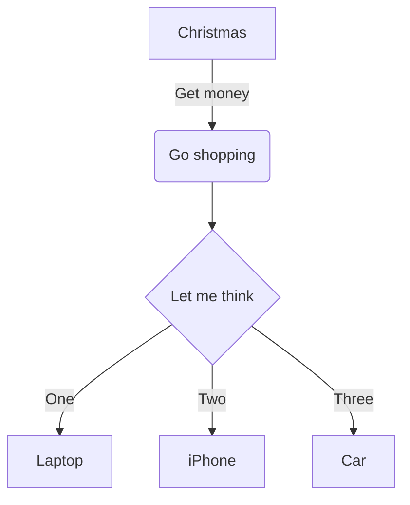

---
{"dg-publish":true,"permalink":"/gitshit/special-syntax/","tags":["syntax","how-to","guide","obsidian","markdown"]}
---

By adding this at the top of any pages, it'll make it easier to search for different topics
```
---
tags:
- tag a
- tag b
---
```
#tags #navigation

Diagrams in obsidian use [mermaid](https://mermaid.live/edit), which can be written using the [mermaid](https://mermaid.live/edit) link.

#flowchart #diagram

|**Title one**|**2nd title**|**Title 3**|**etc**|
| - | :- | -: | :-: |
|non-indented|left-indented|right indented|centred|
#tables #diagram 

Here's some text!
{ #sometext}

[Here's a link to some text!](gitshit/Special%20syntax.md#^sometext)
#links #navigation

Below is a checkbox list
- [ ] g
- [ ] h
- [ ] i
#list 

Obsidian uses [MathJax](https://www.mathjax.org/). [Quick Guide for MathJax](https://math.meta.stackexchange.com/questions/5020/mathjax-basic-tutorial-and-quick-reference)

# Here is a big heading
## Here is a bit smaller a heading
### Here is smaller again
#### This is the third-smallest size 
##### Almost there
###### This is the smallest heading possible
Normal text for scale
#headings #navigation 


